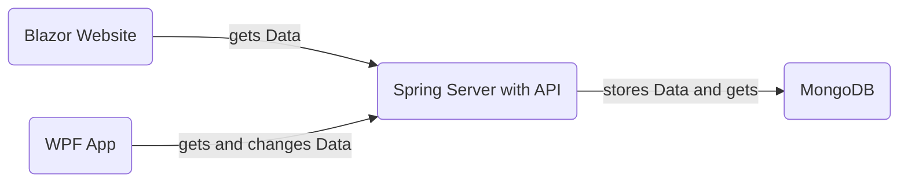
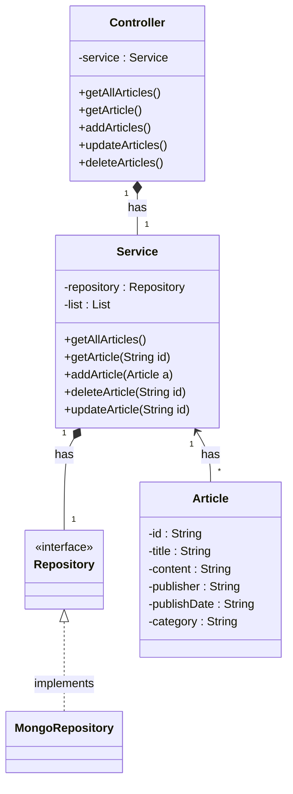

# Dokumentation ArticleAPI
### Inhaltsverzeichnis
* Software Architektur
* Beschreibung Software
	* WPF App
	* Blazor Website
	* Spring Boot Server
* Beschreibung der API
* Diskussion der Ergebnisse
<br>

## Software Architektur

Die zwei Clients greifen ihre Daten vom Server über die API ab und können auch Anfragen an die API senden. Der Server regelt alle Ab- und Abfragen, die über die API anfallen. Außerdem kommuniziert er mit der Datenbank, sodass die Daten auch persistent gespeichert werden.
<br>
<br>
## Beschreibung Software
In diesem Projekt geht es um die Erstellung, Verwaltung und Ansicht von Artikeln. Jeder Artikel hat eine, von MongoDB vergebene, ID, einen Titel, einen Inhalt, eine Kategorie, einen Publisher/Autor und einen Erstellungszeitpunkt (Datum und Uhrzeit). Die Daten werden über eine API bereitgestellt und man kann sie von einer WPF-Anwendung und von einer Website erreichen. 
<br>
<br>

### WPF App
Die WPF App kann sozusagen als Admin-Panel betrachtet werden, da sie alle CRUD-Operationen (Create, Read, Update, Delete) abbildet, die Daten aber relativ roh und ohne Zusammenhang zwischen den Artikeln dargestellt werden. 
<br>
<br>

**POST** <br>
Das Hinzufügen eines Artikels wird mittels HttpClient geregelt. Dieser schickt ein POST-Request mit einem Artikel als JSON Objekt im Body an die API. 
```c#
HttpClient client = new HttpClient();
Article a = new Article();

string json = JsonConvert.SerializeObject(a);
StringContent content = new StringContent(json, Encoding.UTF8, "application/json");

HttpResponseMessage response = client.PostAsync(baseApiURL, content).Result;
```
<br>

**GET** <br>
Um die Artikel zu bekommen und dann anzeigen zu können wird ein GET-Request an die API geschickt. Anschließend werden die Daten im JSON Format in eine Liste von Artikel Objekten umgewandelt.
```c#
response = client.GetStringAsync(baseApiURL).Result;
articles = Newtonsoft.Json.JsonConvert.DeserializeObject<List<Article>>(response);
```
<br>

**PUT/UPDATE** <br>
Dass man Artikel verändern kann, muss man ein PUT-Request an die API schicken. Dieses enthält, wie schon beim POST-Request, das neue, veränderte Artikel Objekt im JSON Format im Body und die ID des Artikels in der URL. 
```c
HttpResponseMessage response = client.PutAsync(URL, content).Result;
```
<br>

**DELETE** <br>
Um Artikel zu löschen kommt ein DELETE-Request zum Einsatz, bei dem die ID des Artikels in der URL mitgegeben werden muss. 
```c
HttpResponseMessage message = await client.DeleteAsync(URL);
```
<br>

### Blazor Website
Auf der Website kann man die Artikel schöner formatiert als bei der WPF App betrachten. Außerdem gibt es noch die Funktion die Artikel nach verschiedenen Parametern zu Gruppieren. Man kann sich also alle Artikel eines bestimmen Publishers anzeigen lassen oder alle Artikel einer Kategorie abrufen. 
Außerdem kann man auf der Website die WPF-Anwendung herunterladen und somit auch Artikel hinzufügen. 

Von den CRUD-Operationen wird auf der Website "Read" abgebildet. Da die Website mit Blazor, ein Framework, das auf C# aufbaut, erstellt wurde, ist der Code rund um das GET-Request der gleiche wie bei der WPF Anwendung. 
<br>
<br>

### Spring Boot Server
Der Server wurde mit dem Spring Initializr erstellt und enthält die dependencies:
```xml
<dependencies>  
	<dependency> 
		<groupId>org.springframework.boot</groupId>  
		<artifactId>spring-boot-starter-data-mongodb</artifactId>  
	</dependency>
	<dependency>
		<groupId>org.springframework.boot</groupId>  
		<artifactId>spring-boot-starter-web</artifactId>  
	</dependency> 
	<dependency>
		<groupId>org.springframework.boot</groupId>  
		<artifactId>spring-boot-starter-test</artifactId>  
		<scope>test</scope>  
	</dependency>
	<dependency> 
		<groupId>org.springframework.boot</groupId>  
		<artifactId>spring-boot-starter-actuator</artifactId>  
	</dependency> 
	<dependency> 
		<groupId>io.micrometer</groupId>  
		<artifactId>micrometer-registry-prometheus</artifactId>  
		<scope>runtime</scope>  
	</dependency>
</dependencies>
```
<br>
Der Server ist folgendermaßen aufgebaut:


<br>

Außerdem gibt es noch die application.properties Datei, die die Serverkonfiguration beinhaltet. Diese sieht wie folgt aus:
```properties
server.port=3002  
spring.application.name = Article-Service  
  
spring.data.mongodb.host=localhost  
spring.data.mongodb.port=27017  
spring.data.mongodb.database=ArticleDB  
  
management.endpoint.health.show-details=always  
management.endpoints.web.exposure.include=*
```
<br>

## Beschreibung der API

<details>
 <summary><code>POST</code> <code>/articles</code></summary>

##### Parameters

> no Parameters
	
##### RequestBody (required)
```yaml
{
"title":  "titleneu",
"content":  "content1",
"publisher":  "Anonymous",
"category":  "natur"
}
```

##### Responses

> http code | response|
> -|-
> `200`        | `Configuration created successfully`
> `400`        | `{"code":"400","message":"Bad Request"}` 
</details>
<br>

<details>
 <summary><code>GET</code>  <code>/articles</code></summary>

##### Parameters

> no Parameters

##### RequestBody
>None

##### Responses

> http code | response|
> -|-
> `200`        | `Successful Operation`
> `400`        | `{"code":"400","message":"Bad Request"}` 
> `404`        | `Not found`
</details>
<br>

<details>
 <summary><code>PUT</code> <code>/articles/{id}</code></summary>

##### Parameters

> no Parameters

##### RequestBody (required)
```yaml
{
"id": "64666ae5d0ee1801cb2260ed"
"title":  "titleneu",
"content":  "content1",
"publisher":  "Anonymous",
"category":  "natur"
}
```

##### Responses

> http code | response|
> -|-
> `200`        | `Configuration created successfully`
> `400`        | `{"code":"400","message":"Bad Request"}` 
> `404`        | `Not found` 
</details>
<br>
<details>
 <summary><code>DELETE</code> <code>/articles/{id}</code></summary>

##### Parameters

> no Parameters

##### RequestBody
> None
> 

##### Responses

> http code | response|
> -|-
> `200`        | `Success`
> `400`        | `{"code":"400","message":"Bad Request"}` 
> `404`        | `Not Found`
</details>
<br>

## Diskussion Ergebnisse
Das Endprodukt dieses Projektes ist eine Spring Boot Applikation, an die, über eine API, Anfragen geschickt werden können. Diese ist mit einer MongoDB Datenbank verbunden und speichert die Artikel darin. Die WPF-Anwendung agiert als "Admin-Panel", da man von ihr aus die Artikel hinzufügen, ändern, löschen und anzeigen lassen kann (wenn auch nicht schön formatiert). 
Die Blazor Website ist zur Veranschaulichung der Daten / Artikel da. Auf ihr werden die Daten schön und übersichtlich dargestellt und es gibt auch die Möglichkeit die WPF-Anwendung herunter zu laden. 

Ich habe mich für die Erstellung der Website für Blazor entschieden, da die Wahl des Frameworks nicht vorgegeben war und man mit Blazor schnell eine funktionierende Website hat und man somit am Anfang schon eine Grundlage zum weiteren Arbeiten hat. 
Spring Boot habe ich gewählt, da wir es im Unterricht schon oft benutzt haben und ich mich damit schon ausgekannt habe. 
<br>
<br>

## Quellenverzeichnis / Links
* https://learn.microsoft.com/en-us/dotnet/desktop/wpf/?view=netdesktop-7.0
* https://stackoverflow.com/
* https://dotnet.microsoft.com/en-us/apps/aspnet/web-apps/blazor
* https://learn.microsoft.com/en-us/aspnet/core/blazor/?view=aspnetcore-7.0
* https://www.markdownguide.org/basic-syntax/
* https://mermaid.js.org/
